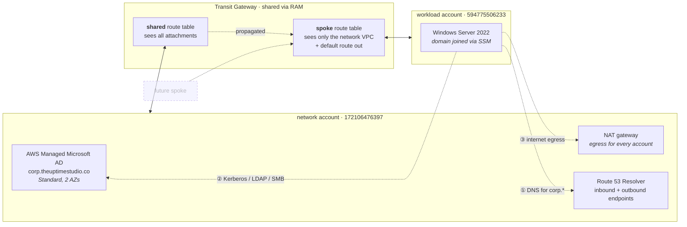
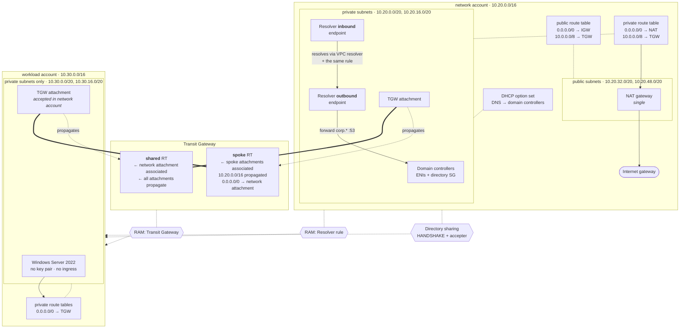

# Identity isolation lab

A two-account AWS lab in Terraform. **Identity lives in the network account and
the workload account never hosts a domain controller.** A Windows instance in
the workload account joins `corp.theuptimestudio.co` across a Transit Gateway,
using a directory it does not own, over a path with no SSH or RDP anywhere in it.

| Account  | ID             | Provider alias | Holds                                                   |
| -------- | -------------- | -------------- | ------------------------------------------------------- |
| network  | `172106476397` | `aws.network`  | Managed Microsoft AD, TGW, NAT egress, Resolver endpoints |
| workload | `594775506233` | `aws.workload` | Private VPC and one domain-joined Windows instance        |

Region `us-east-1`. Both accounts sit in organization `o-jxhjz490ll`, network
being the management account.

## High level



The **spoke** route table is the isolation boundary. It carries a route to the
network VPC and a default route for egress, and nothing else — so a second spoke
added tomorrow can reach identity and the internet, but not this one.

## Detail



### How the workload instance resolves `corp.theuptimestudio.co`

1. The instance asks the Amazon resolver at `10.30.0.2` — the workload VPC keeps
   the default DNS server, with no DHCP option set of its own.
2. A Route 53 Resolver **forwarding rule**, created in the network account,
   shared via RAM and associated with the workload VPC, matches the AD zone.
3. The query passes through the **outbound endpoint** named on that rule, in the
   network VPC, and is forwarded to the domain controllers' DNS IPs.
4. Everything else resolves normally through the Amazon resolver.

**One deviation from the original brief, deliberate.** The brief called for the
rule to forward to the *inbound endpoint* IPs. That does not resolve anything on
its own: an inbound endpoint answers out of the network VPC's resolver, which
knows nothing about the AD zone until this very rule is associated with that VPC
— at which point the rule points at itself and loops. The rule targets the domain
controllers directly instead, which is the hop that actually resolves. The
inbound endpoint is still built, doing the job an inbound endpoint is for:
serving as the DNS ingress point for anything outside the VPC, and it now
answers correctly for the AD zone because the same rule is associated with the
network VPC.

### How it joins the domain

`AWS-JoinDirectoryServiceDomain`, driven by an `aws_ssm_association`, pointed at
the **shared directory ID** — the identifier minted in the workload account when
the network account shared the directory. Cross-account seamless join is not
possible without that share.

## Getting started

```bash
cp terraform.tfvars.example terraform.tfvars   # then set a real password
terraform init
terraform plan
terraform apply
```

A full apply runs roughly 30–50 minutes; most of that is Managed AD creating
domain controllers.

### Prerequisite, once per organization

```bash
aws ram enable-sharing-with-aws-organizations --profile network
```

Without it, RAM treats the workload account as external, invitations go
unaccepted, and the TGW attachment fails. It is an organization-level setting,
so it survives `terraform destroy` and only needs running once.

### Verifying

```bash
terraform output session_manager_command    # prints the ssm start-session line
```

Then on the instance:

```powershell
nltest /dsgetdc:corp.theuptimestudio.co     # a domain controller answers
Resolve-DnsName corp.theuptimestudio.co     # returns the DC private IPs
(Get-WmiObject Win32_ComputerSystem).Domain # corp.theuptimestudio.co
```

## Tearing down

```bash
terraform destroy
```

Directory sharing and the TGW attachment unwind in the right order on their own.
Expect the directory itself to take a while.

## Design notes

Layout, conventions, and the traps worth knowing before editing are in
**[AGENTS.md](AGENTS.md)**.
